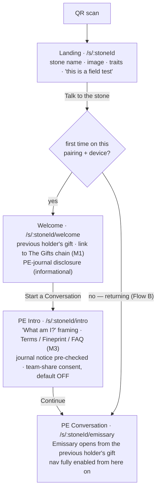
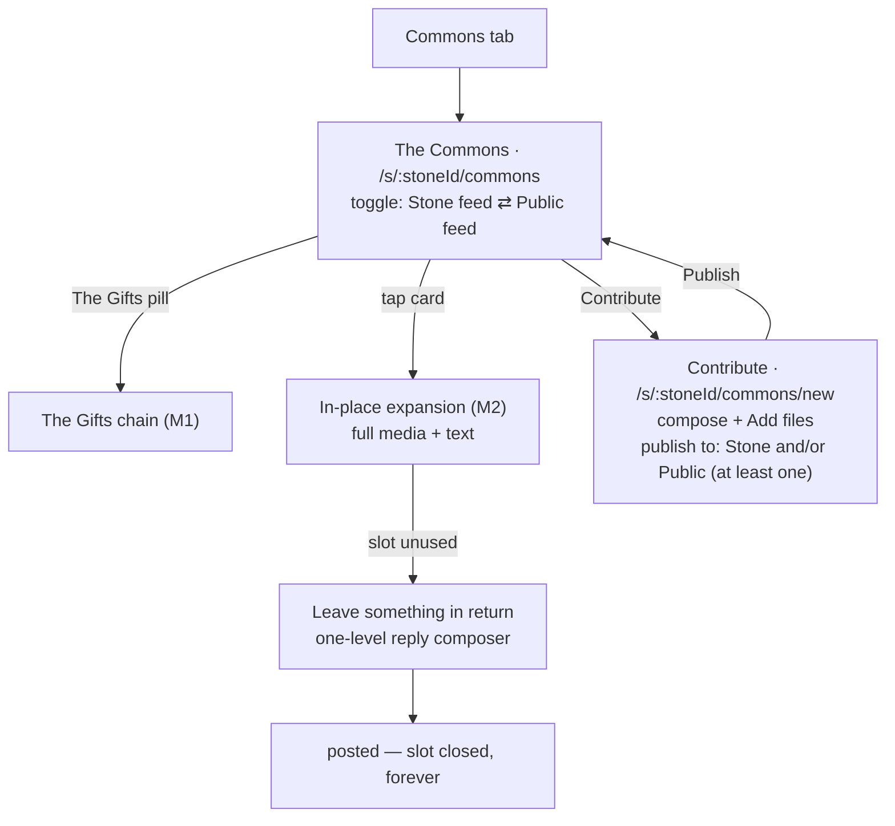
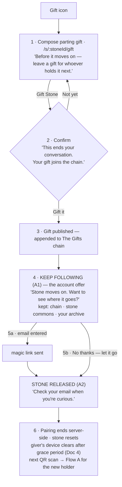
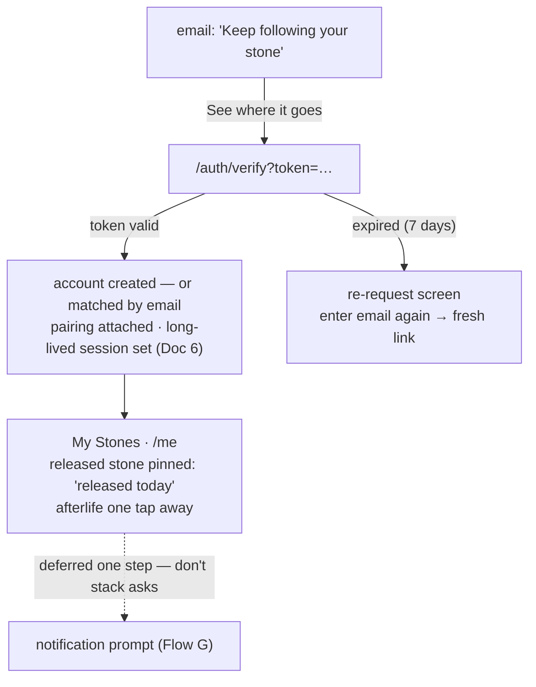
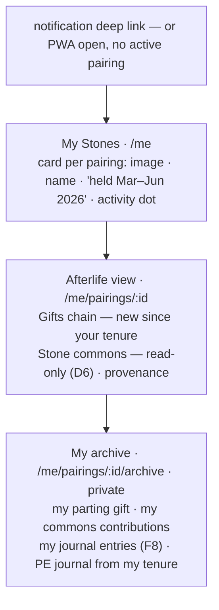

# Stonemaps — Core User Flows

**Doc 3 of the IA/UXD documentation set · Phase 1**
Status: Draft v1 · 2026-07-02
Terms per [00-concept-glossary.md](00-concept-glossary.md); routes and gating per [02-site-map-ia.md](02-site-map-ia.md).

Seven flows. A–D exist in the prototype (documented here with gaps resolved); E–G are new (account layer). Each flow lists its screens, steps, states, and edge cases. Copy shown in *italics* is directional — final copy must match the established voice (Doc 1 §5).

---

## Flow A — First touch: stranger meets stone

**Trigger:** person scans the QR on a stone (or opens a shared stone URL).
**Screens:** Landing → Welcome → PE Intro → PE Conversation.
**Goal:** from curiosity to first exchange with the Emissary in under a minute, zero identity friction.



**States & rules**
- Nav greyed until Conversation is reached (per prototype).
- The Emissary's opening message is generated from the previous holder's parting gift — if the stone has never been held (first circulation), a defined "first words" opening is needed. **[gap: first-circulation opening copy]**
- Consent checkbox state must persist with the pairing, changeable later (where? recommend PE Intro content reachable from PE Journal modal — **[gap: settings surface for consent in Stone Context]**).

**Edge cases**
| Case | Behavior |
|---|---|
| Revisit mid-pairing (same device) | Skip gate → straight to Conversation (Flow B) |
| Stone currently held by someone else | Bystander view (IA §1 ⚠️ — TBD, recommend Landing without CTA, *"This stone is with someone right now."*) |
| Stone URL opened on desktop | Works (PWA is responsive web first); QR flow unaffected |
| Second device, same holder | MVP: treated as bystander/new — known limitation, note in field-test guide **[accepted risk]** |

---

## Flow B — Returning current holder

**Trigger:** reopening the PWA / re-scanning during an active pairing.
**Path:** `/` resolver → active pairing found → PE Conversation, history intact.
Conversation history restores from device-local storage (Doc 4). No gate, no login. If the holder had signed in previously (Flow F user who took on a new stone), same path — account changes nothing in Stone Context.

---

## Flow C — Commons: read, contribute, reply

**Screens:** The Commons → expanded card (M2) → Contribute.



**Rules**
- Reply slot: one reply, ever, per card; no threading (workflow notes). The reply renders inside the expanded card, attributed to the stone (*"from Pierrot's holder"*), not to a named person.
- Publish-to validation: zero boxes checked → Publish disabled. **[gap: neither prototype nor workflow defines Stone-only vs Public-only vs both rendering differences in feed — Doc 4 defines the model; UI needs a subtle scope marker on cards]**
- Anonymity: Commons posts carry stone attribution only. No usernames anywhere in Stone Context, even for signed-in users.

---

## Flow D — Gift the Stone (handoff) — now hosts the claim moment

**Screens:** Gift the Stone → **Keep Following (A1, new)** → **Stone Released (A2, new)** → stone resets.
This is the prototype's `Gift → 1-landing.html` shortcut expanded into the real sequence. Order matters: **email capture happens before reset**, while the giver still has standing.



**Rules & edge cases**
| Case | Behavior |
|---|---|
| Gift composed but abandoned (✕) | Draft kept device-local; gift not published, pairing continues |
| Empty gift | Disallow — the chain is the product's spine; require text or media |
| Email typo / link never clicked | Pairing still ends (gifting is never blocked on auth); claim token stays valid 7 days, attached to the pairing (Doc 4) |
| Already signed in when gifting | Skip A1; A2 confirms *"You'll keep following <Stone> — it's in your stones."* |
| Wants account but hasn't gifted yet | Not offered in MVP (product decision: post-gift only); Landing's "Held a stone before?" is for returning account holders, not first-claim |

> **F8 note:** if My Journal ships, step 4 also mentions *"your journal entries stay yours."* If it doesn't, the claim offer rests on the chain + commons + archive alone.

---

## Flow E — Claim: magic link → account (new)

**Trigger:** tapping the magic link from Flow D step 5a (or Flow G's sign-in).
**Screens:** email client → `/auth/verify` → My Stones.



**Rules**
- Token single-use, 7-day expiry; expired → friendly re-request screen (enter email again, new link).
- If the email already has an account, the new pairing simply attaches — same flow, no "log in vs sign up" fork. **Passwordless means there is only one auth flow in the whole product.**
- Opening the link in a plain browser while the PWA is installed is the known hard case — behavior defined in Doc 6 (must be resolved before build).

---

## Flow F — Return visit: the afterlife (new)

**Trigger:** notification email deep link, or opening the PWA with no active pairing.
**Screens:** My Stones → Stone afterlife → My archive.



**Rules**
- Read-only afterlife per IA D6: past holders can look, not post. Revisit post-field-test.
- Privacy boundary (hard): a past holder **never** sees the current holder's PE conversation or the PE journal of any tenure but their own.
- Activity dot = unseen afterlife events (new gift, new stone-commons post); cleared on view. This is the retention loop's in-app half; email is the other half (Flow G).

---

## Flow G — Notifications & re-engagement (new)

**Opt-in moment:** first visit to My Stones after claim (Flow E), one screen, defaults conservative.

```
"Want to hear when something happens?"
  ☑ A new holder leaves a gift            (email)
  ☑ Someone replies to something you left  (email)
  ☐ Stone commons activity digest          (email, weekly)
  Push notifications: offered only after ≥1 email engagement (Doc 5 rationale)
  [Save] / [Not now]  → never ask again unprompted; editable in /me/settings
```

Full trigger matrix, channel strategy, and copy in Doc 5. Principles fixed here:
1. **Event-driven, not engagement-bait** — notify on chain/reply events, never "come back!" nudges. Matches the product's non-coercive voice.
2. **Email first, push later** — magic-link users are email-verified by definition; PWA push is fragile (iOS requires A2HS install; Doc 6).
3. Every email deep-links to the exact afterlife view it describes.

---

## Flow-to-screen build coverage

| Flow | Built | Missing/new screens needed |
|---|---|---|
| A First touch | 1, 2, 3, 4 | M1 Gifts chain, M3 Terms/FAQ, first-circulation opening |
| B Return (holding) | 4 | — |
| C Commons | 5, 5b | M2 expanded card + reply composer |
| D Gift + claim | 7 | A1 Keep Following, A2 Stone Released, confirm dialog |
| E Claim/verify | — | A8 sign-in, A9 link-sent, verify screen, expired-token screen |
| F Afterlife | — | A4 My Stones, A5 afterlife, A6 archive |
| G Notifications | — | A7 settings + opt-in screen |

**Suggested build order** (each slice independently shippable): A+B (exists, wire up) → C (M2 completes the social loop) → D through step 3 (handoff works without accounts) → D4–5 + E (claim) → F → G.
